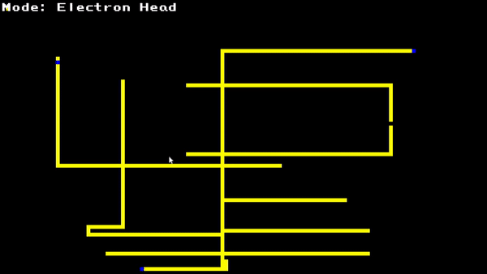

# Built using olcPixelGameEngine framework
https://github.com/OneLoneCoder/olcPixelGameEngine

# Wire World
**Wireworld is a cellular automaton first proposed by Brian Silverman in 1987, 
as part of his program Phantom Fish Tank. Wireworld is particularly suited to simulating transistors**

# Rules
### A Wireworld cell can be in one of four different states, usually numbered 0–3 in software, modeled by colors in the examples here:

 0. empty (black)
 1. electron head (blue)
 2. electron tail (red)
 3. conductor (yellow)

### As in all cellular automata, time proceeds in discrete steps called generations (sometimes "gens" or "ticks"). Cells behave as follows:

 * empty → empty,
 * electron head → electron tail,
 * electron tail → conductor,
 * conductor → electron head if exactly one or two of the neighbouring cells are electron heads, otherwise remains conductor.

# Examples
## Random Looping Circuit

## XOR Gate

